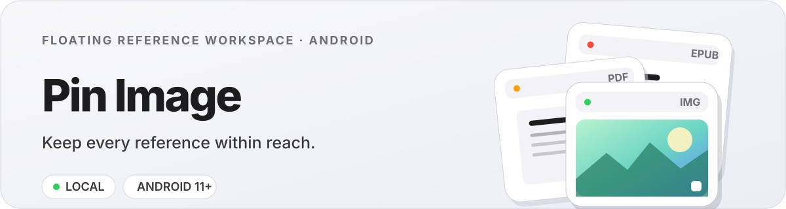

<p align="center">
  
</p>

<p align="center">
  <strong>English</strong> · <a href="./README.zh-CN.md">简体中文</a>
</p>

Pin Image keeps images, boards, PDFs, and EPUB books above your other Android apps. Capture or import a reference, pin it in a resizable floating frame, then pan, zoom, rotate, style, or resume reading without leaving your current workspace.

## Highlights

- **Independent frame and content controls** — resize the floating window without changing the image scale, or pan and zoom the content without moving its frame.
- **Images, PDFs, and EPUBs** — scroll documents, jump between PDF pages, adjust EPUB text size, and restore the last reading position.
- **Multi-image boards** — arrange, transform, layer, duplicate, and export several references on one canvas.
- **Local photo editing** — crop, rotate, flip, undo, apply seven filter presets, or manually tune 13 image parameters.
- **A practical local library** — previews, names, rename, single or batch removal, and double-tap protection against accidental pins.
- **Private by design** — no `INTERNET` permission, accounts, analytics, ads, or cloud upload.

## Download

Android 11 or newer is required. Download the newest APK from [GitHub Releases](https://github.com/oodadoudou/pin-image/releases/latest).

Because the APK is distributed outside Google Play, Android may ask you to allow installation from your browser or file manager.

## Permissions

- **Display over other apps** shows floating references.
- **Accessibility Service** enables the optional one-tap screenshot button. Pin Image only invokes Android's screenshot API and does not inspect screen content.
- **Notifications** provide persistent hide, show, and close controls.
- **Photo Picker** imports images without broad storage access.

## Build from source

Requirements: Android SDK 35 and JDK 17.

```sh
./gradlew :app:assembleDebug
```

The APK is generated at `app/build/outputs/apk/debug/app-debug.apk`.

## Format notes

PDF reading uses Android's local PDF renderer. EPUB support targets non-DRM EPUB 2/3 reflowable books; scripted, DRM-protected, and complex fixed-layout publications may not render completely.

## License

Copyright © 2026. All rights reserved.
